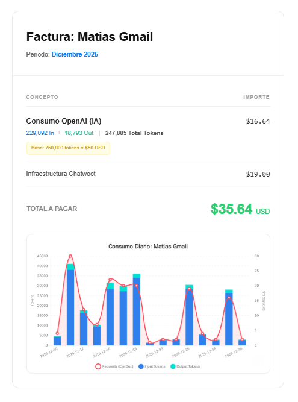

# ⚙️ Automated Billing & Payment Workflow – N8N & Power Automate

## 🧠 Business Problem
The company generated monthly bills and registered client payments manually.
This process was time-consuming, error-prone and difficult to scale as the
number of clients increased.

## 🗂 Process & Data Sources
- Client usage data in PDF format
- Google Sheets / Excel
- External APIs
- Email-based billing process

## 🛠 Tools & Technologies
- N8N
- Power Automate
- Google Sheets / Excel
- PDF processing
- OpenAI API
- REST APIs

## ⚙️ Solution
I designed an automated end-to-end workflow that:
- Extracts client usage data from PDF files
- Cleans and transforms the data
- Generates dynamic HTML invoices
- Sends scheduled billing emails automatically

## 🚀 Impact
- Significant reduction in manual work
- Improved billing accuracy
- Faster and more reliable invoice delivery

## 🖼 Workflow Preview

### PDF to Sheet

### Generated Invoice

### AI-Assisted Invoice

