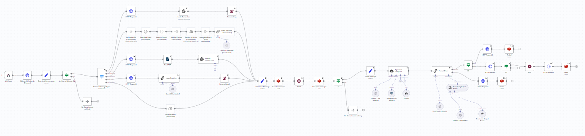
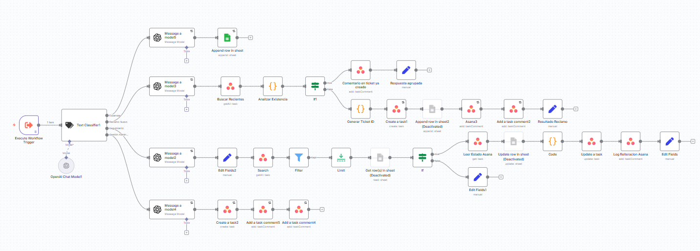

# 🤖 Public Support Agent & Ticket Tracking – N8N, WhatsApp & Asana

## 🧠 Business Problem
The company was losing customers due to slow response times and lack of
visibility over customer requests. Messages received through WhatsApp were
handled manually, with no centralized tracking or follow-up.

This made it difficult to ensure timely responses and manage support workload.

## 🗂 Process & Data Sources
- Customer messages via WhatsApp
- Support requests and inquiries
- Task and ticket tracking in Asana
- Calendar scheduling for follow-up actions

## 🛠 Tools & Technologies
- N8N
- WhatsApp API
- OpenAI API
- Asana API
- Calendar integration

## ⚙️ Solution
I designed an AI-powered public support agent that:
- Provides automated first-level responses 24/7
- Classifies customer requests using AI
- Creates and updates tickets in Asana
- Assigns tasks to the appropriate team
- Tracks ticket status and follow-up actions
- Shares scheduling links when required

The workflow ensures fast response times and clear traceability of each request.

## 🚀 Impact
- Reduced response time to customer inquiries
- Improved visibility of support tickets
- Better workload distribution across the team
- Increased customer satisfaction and retention

## 🖼 Workflow Preview

