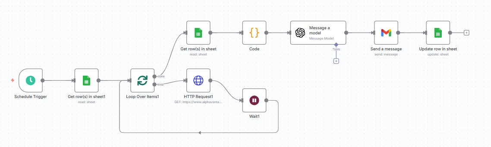

# 🚨 Action Tracking & Alerts Automation – Financial Operations

## 🧠 Business Problem
Financial actions such as payments, collections and approvals were tracked
manually using spreadsheets and emails. This made it difficult to monitor
pending actions, detect delays and ensure timely follow-up.

The lack of automated alerts increased the risk of missed deadlines and
operational inefficiencies.

## 🗂 Process & Data Sources
- Financial action records (Excel / Google Sheets)
- Payment and collection status
- Dates, deadlines and responsible parties
- Email notifications

## 🛠 Tools & Technologies
- N8N
- Power Automate
- Google Sheets / Excel
- Email services
- APIs

## ⚙️ Solution
I designed an automated action tracking workflow that:
- Monitors financial actions and their current status
- Identifies pending, overdue or critical actions
- Triggers automated alerts based on defined rules
- Sends notifications to responsible stakeholders via email

The workflow runs on a scheduled basis and updates action statuses automatically.

## 🚀 Impact
- Improved visibility of financial operations
- Reduced risk of missed payments and deadlines
- Faster follow-up on critical actions
- More reliable and controlled financial processes

## 🖼 Workflow Preview

