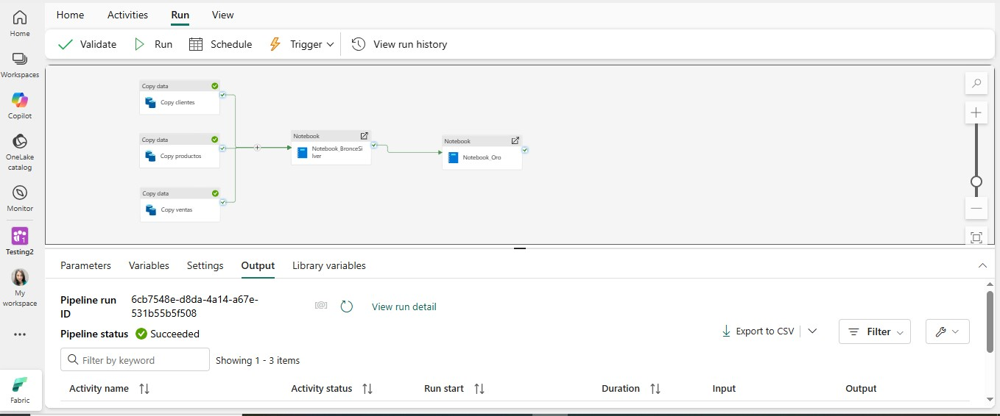
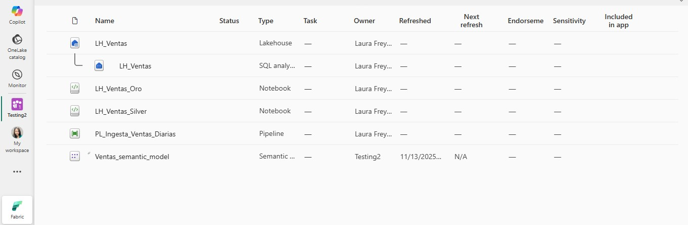
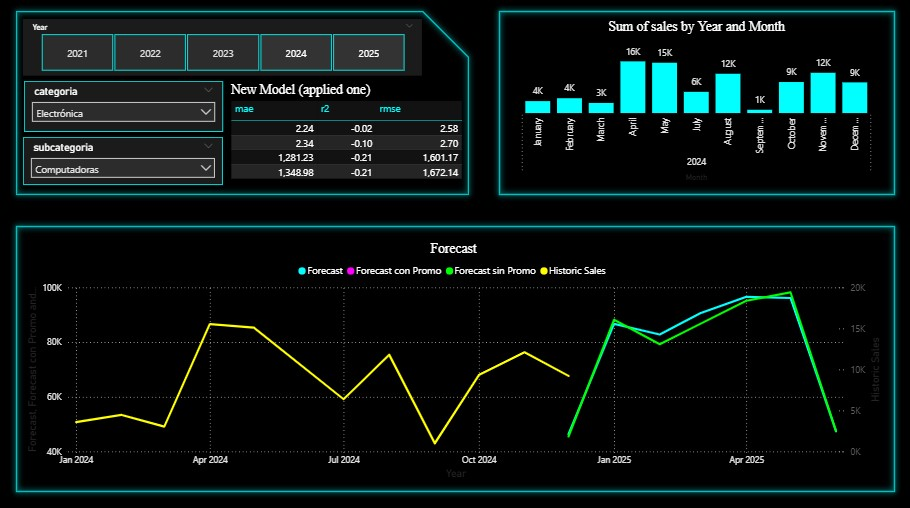
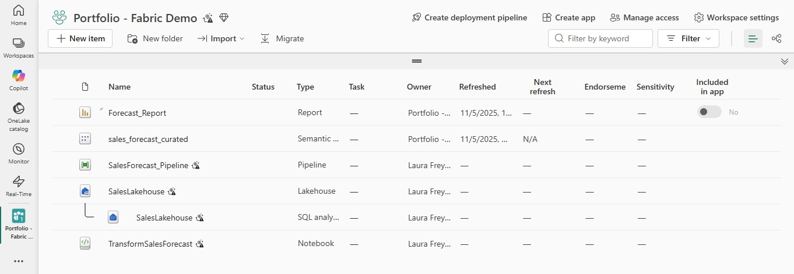

# ⚙️ Fabric & Python Automated Analysis Reporting

## 🧠 Business Problem
The company needed to generate analytical reports using unstructured data and
combine information from multiple data sources. This process was performed
manually on a monthly basis, making it repetitive, error-prone and
time-consuming.

As data volume increased, maintaining data quality and consistency became
increasingly difficult.

## 🗂 Process & Data Sources
- Excel / Google Sheets
- Databases
- Unstructured and semi-structured data (JSON)

## 🛠 Tools & Technologies
- Microsoft Fabric
- Python
- JSON
- Power BI

## ⚙️ Solution
I designed an automated data pipeline that:
- Cleans and transforms raw data into a usable semantic model
- Executes Python notebooks to calculate sales and quantity forecasts
- Integrates forecast results into the data model
- Automatically updates Power BI dashboards

The solution ensures data consistency and enables scalable analytics.

## 🚀 Impact
- Significant reduction in manual data cleaning efforts
- Improved data accuracy and reliability
- Faster access to updated insights and forecasts

## 🖼 Workflow Preview
### 💻​ Pipeline with Fabric:

### 💻​ Forecast with Python and Fabric:

Forecast for sales and quantity made with a Python script.  
🔗 **Full script:** [forecast_script_pro.py](images/forecast_script_pro.py)

