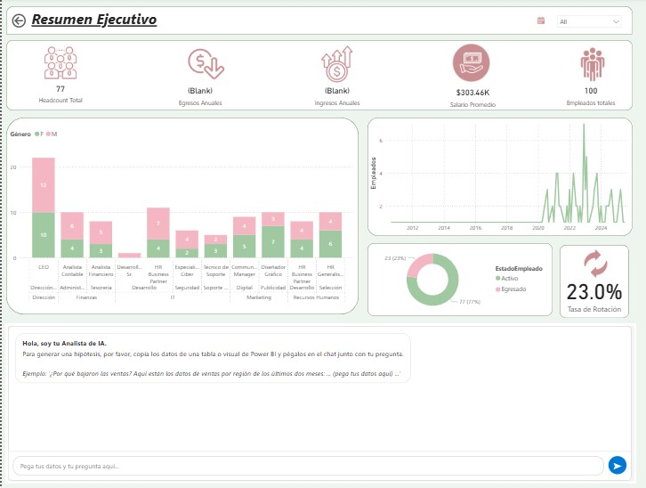
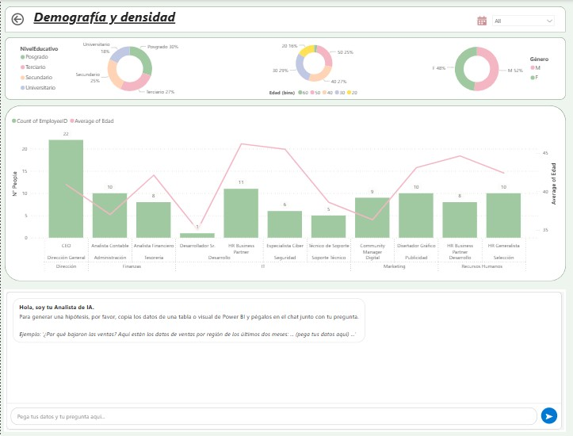
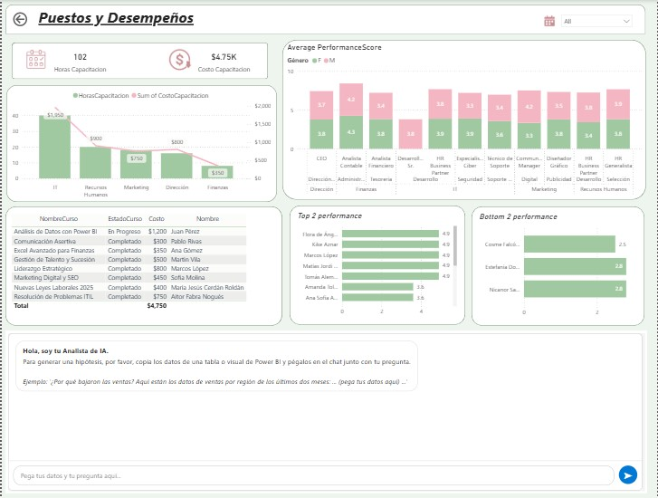

# 📊 Executive HR Dashboard – Power BI

## 🧠 Business Problem
The company needed a clear and centralized view of HR performance.
Reports were generated manually, making it difficult for management to
identify trends in human resource, compare years and make data-driven decisions.

## 🗂 Data
- Simulated sales dataset (CSV format)
- +50,000 rows
- Includes salaries, capacitation, regions, roles and dates

## 🛠 Tools & Technologies
- Power BI
- Power Query
- DAX
- AI

## 📊 Solution
I designed an interactive executive dashboard that allows users to:
- Monitor key sales KPIs
- Analyze performance by region and product
- Use filters and drill-downs for deeper insights

The data model was optimized to ensure fast performance and scalability.

## 🚀 Impact
- Reduced manual reporting time
- Improved visibility of sales trends
- Enabled faster decision-making for stakeholders

## 🖼 Dashboard Preview

### Overview

## 🔗 Demo
Power BI Public link (coming soon)
